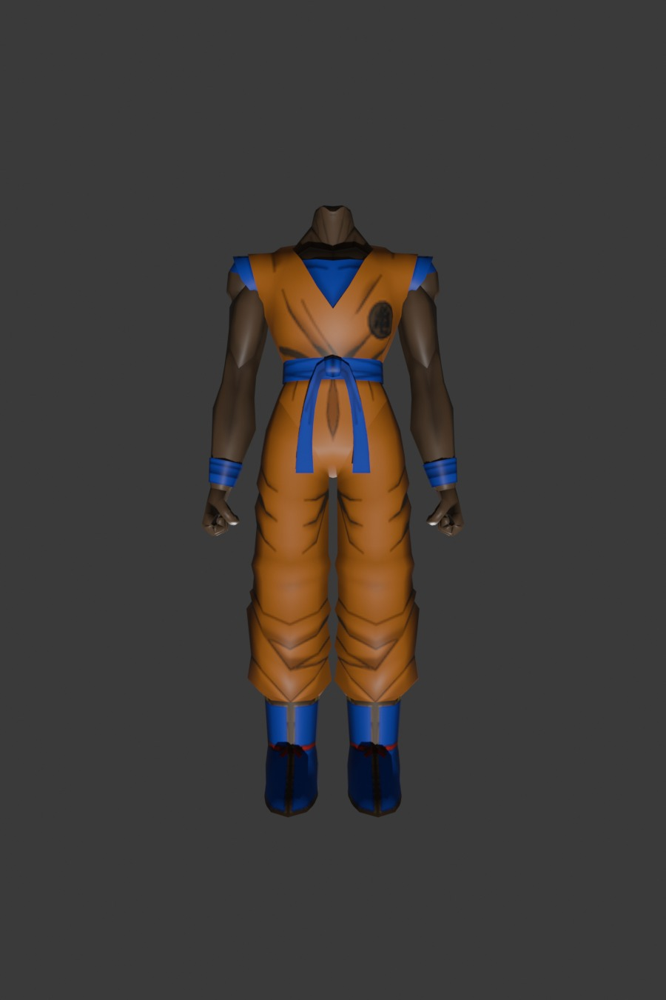
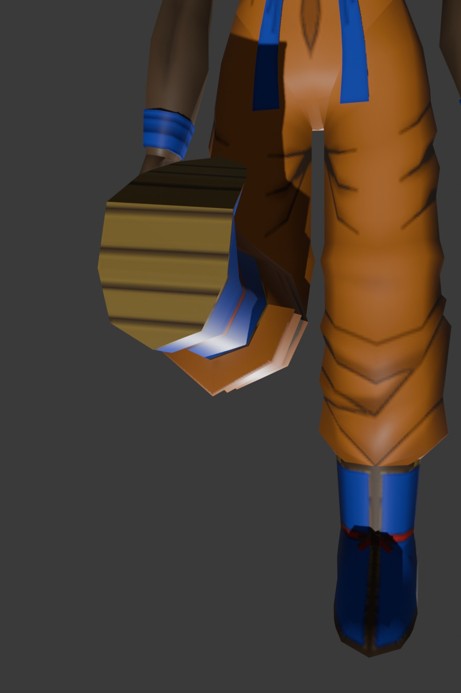
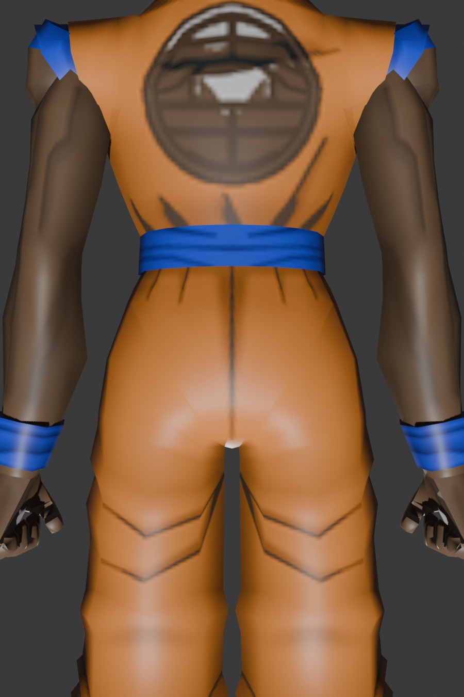

# DatFiles

Modular DAT overrides for Final Fantasy XI via **[XIPivot](https://github.com/Darkdoom/XIPivot)**.

## Installation

Drop any pack folder into your XIPivot directory:

```text
Windower4/addons/XIPivot/data/DATs/
├── Tronmenos/
│   └── ROM3/3/82.DAT
└── GokuTrackSuit/
    └── ROM/339/
        ├── 25.DAT
        └── 26.DAT
```

Enable in XIPivot via in-game Windower console:
```text
//pivot add Tronmenos
//pivot add GokuTrackSuit
```

---

## Packs

### GokuTrackSuit (Track Shirt & Track Pants - Elvaan Male)
* **Target**: `ROM/339/25.DAT` (Body 579), `ROM/339/26.DAT` (Legs 579)
* **In-Game Lockstyle**: **Track Shirt** (`#25713`) & **Track Pants** (`#27325`)
* **Changes**: Complete Son Goku Gi costume replacement for Elvaan Male.
  - **5-Joint Leg Kinematics**: Fully weighted Shin (`joint-13`/`joint-7`), Ankle (`joint-14`/`joint-8`), and Toe (`joint-15`/`joint-9`) with Smoothstep Hermite sole curvature—zero tearing or hovering toe caps during the `/heal` kneeling animation.
  - **Zero Z-Fighting Waist Interface**: Flared blue sash ($+1.5\%$) with $6.5\,\text{mm}$ clearance over an inset waistband ($-3.0\%$) textured in matching Royal Blue.
  - **D3D8 Calibrated Shading**: Specular highlights compressed for Vana'diel sunlight; collar line contoured to Elvaan Male Face 10 hair seam.
  - **Hardware Compliant**: Strict $\le 2$ bone weights per vertex.

| Front Stance | Kneeling Flex (`/heal`) | Waist & Belt Interface |
|:---:|:---:|:---:|
|  |  |  |

---

### Tronmenos (Zone 37 - Temenos)
* **Target**: `ROM3/3/82.DAT`
* **Changes**: Dark floor and cyan circuit walls/pillars.

| Chamber | Hallway |
|:---:|:---:|
|  |  |

---

## 📚 Technical Documentation
* [Cross-Engine & Topological Equipment Modding Guide](docs/CROSS_ENGINE_AND_TOPOLOGICAL_MODDING_GUIDE.md): Authoritative architectural runbook for porting foreign meshes (FFXIV, anime), Direct3D 8 $\le 2$ bone skinning, 5-joint leg kinematics, waist clearance, and diffuse baking.
* [Character Armor Rigging & Particle Generator Handbook](docs/FFXI_ARMOR_AND_PARTICLES.md): Direct3D 8 skinning limits, submesh partition laws, and particle emitter architecture.
* [FFXI DAT Engineering Technical Knowledge Dump](docs/DAT_KNOWLEDGE_DUMP.md): Raw binary offsets, bitmasks, shader equations, and DXT1 algorithms.
