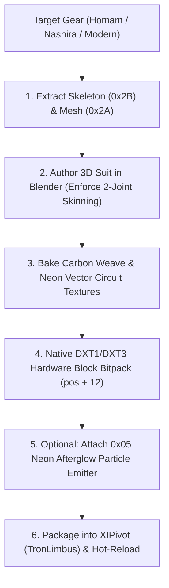

# 🥋 FFXI Character Armor, 3D Mesh Rigging & Particle Mastery Handbook
**Document Version:** 1.0.0 (Unified Entity & Equipment Reference)  
**Target Architecture:** Final Fantasy XI Character Equipment (`0x2A`), Particle Generators (`0x05`), and Modern Blender Pipeline  
**Author & Research Team:** Antigravity / State-Null  

---

## 1. Overview & Equipment Architecture

Unlike static zone DATs (which use `0x2E` local-space terrain meshes instanced via `0x1C` ZoneDef), **Character Equipment and Weapon DATs** are dynamic, skinned skeletal entities rigged to player race joints.

```text
┌──────────────────────────────────────────────────────────────────────────────────┐
│                           FFXI Equipment DAT Anatomy                             │
├──────────────────────────────────────────────────────────────────────────────────┤
│ 0x00000000: DAT Root Header Tag                                                  │
│ 0x00000020: 0x2B / 0x2C Skeleton Definition (Joint Hierarchy & Global Transforms) │
│ 0x00000500: 0x2A Skinned Skeleton-Mesh (Vertices rigged in joint-local space)     │
│ 0x00020000: 0x20 (3TXD) Texture Banks (DXT1 / DXT3 / CLUT8)                      │
│ 0x00040000: 0x05 Particle Generators (Afterglow, Auras, Weapon Trails)           │
└──────────────────────────────────────────────────────────────────────────────────┘
```

---

## 2. Character Appearance & 20-Byte "Look" Blob (`look_t`)

In client-server communication and NPC data, character appearance is defined by a 20-byte `look_t` structure:

```text
Offset | Type   | Field Description
-------|--------|------------------------------------------------------------
+0x00  | uint16 | Size / Model Type (0 = standard, 1 = player equipped, 7 = chocobo)
+0x02  | uint8  | Face Index
+0x03  | uint8  | Race Index (1: HumeM, 2: HumeF, 3: ElvaanM, 4: ElvaanF, 5: TaruM, 6: TaruF, 7: Mithra, 8: Galka)
+0x04  | 8x u16 | Equipped Slot Words: [head, body, hands, legs, feet, main, sub, ranged]
```

### 2.1 The Equipped Slot Word Bitmask:
* **Top 4 Bits (`0xF000`)**: Slot Index.
* **Low 12 Bits (`0x0FFF`)**: **Gear Model ID** (e.g. `0x20AC` $\rightarrow$ Body Slot, Model ID `172`).
* The Model ID maps to a specific `ROM` File ID via race-specific lookup tables (Atom0s gear tables).

---

## 3. The 3D Skinned Skeleton-Mesh Section (`0x2A`)

### 3.1 Hard Engine Constraints for 3D Mesh Modding:
1. **The 2-Joint Bone Influence Limit**:
   * FFXI’s rendering pipeline allows **at most 2 joint influences per vertex** ($j_0, j_1$) with normalized weights ($w_0 + w_1 = 1.0$).
   * If importing from modern DCC tools (Blender/Maya) with 4-bone weights, influences beyond the top 2 must be dropped and the remaining two renormalized.
2. **Joint-Local Coordinate Baking**:
   * Vertices are not stored in global world coordinates; they are baked into the local space of their primary parent bone joint:
     $$\mathbf{P}_{\text{local}} = \mathbf{R}_{\text{joint}}^{-1} \cdot (\mathbf{P}_{\text{world}} - \mathbf{T}_{\text{joint}})$$

### 3.2 Automated glTF/FBX $\rightarrow$ FFXI Alignment (Kabsch SVD):
To align modern Blender glTF exports onto FFXI character skeletons without manual axis guessing, the **Kabsch SVD Algorithm** finds the optimal rigid transformation $(R, s, t)$ between GLB inverse-bind matrices and FFXI bone origins:
$$\text{Covariance } H = (\mathbf{P}_{\text{src}} \cdot s)^T \cdot \mathbf{P}_{\text{dst}}, \quad [U, S, V^T] = \text{SVD}(H), \quad R = V \cdot \text{diag}(1, 1, \det(V \cdot U^T)) \cdot U^T$$

---

## 4. Particle Generators (`0x05`) & Weapon Afterglow

Particle effects in armor and weapon DATs (e.g. glowing runes, fire/ice enchantments, Relic afterglows) are governed by `0x05` generator sections:

### 4.1 Particle Binary Header:
* `offset + 0x76` (uint16): `framesPerEmission` (controls spawn rate; set to `0xFFFE` to silence).
* `offset + 0x79` (uint8): **Auto-Run Execution Mask** (bit 4 `0x10`).
* `offset + 0x84` (uint32): Offset to `sec2` Initializer Opcodes.

### 4.2 Initializer Opcode Opcodes:
* **Opcode `0x01` (StandardSetup)**: Initial velocity, gravity, particle lifetime (at payload offset `30..32`), and base RGBA tint.
* **Opcode `0x02` (Velocity Scale)**: Velocity multipliers across X, Y, Z.
* **Opcode `0x03` (Spread Radius)**: Spatial emission sphere / cylinder variance.
* **Opcode `0x04` (Color Keyframe)**: Alpha fade-in/fade-out curves and RGB color transitions.

---

## 5. Modern Tron Armor Production Workflow



---

## 6. Key Takeaways:
1. **Armor is Safe & Independent**: No walkmesh, no collision boundaries, no zone lines.
2. **Skinning Rule**: Strictly clamp to 2 bone influences per vertex before serializing to `0x2A`.
3. **Materials**: Use DXT1 (opaque carbon armor) or DXT3 (translucent visors/energy capes).
4. **Particles**: Neon glow can be injected via native `0x05` generator opcodes bound to spine/shoulder bone nodes.
